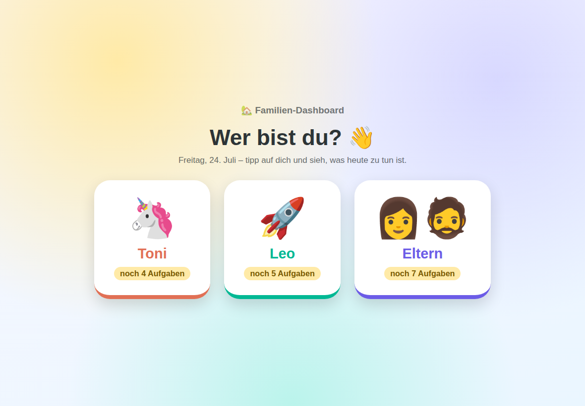
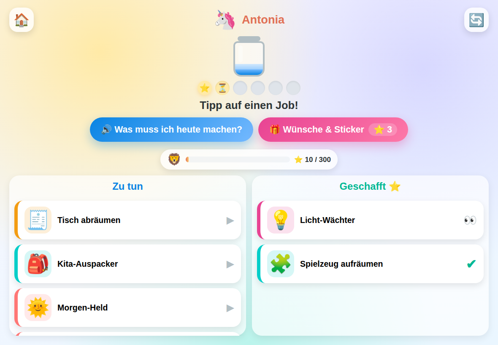
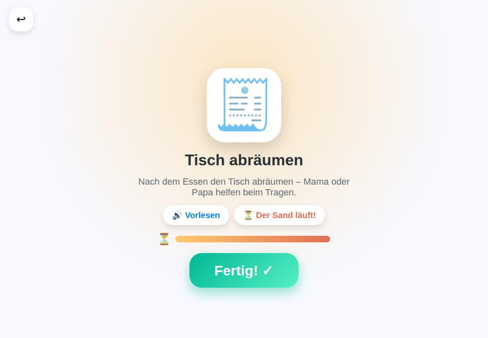
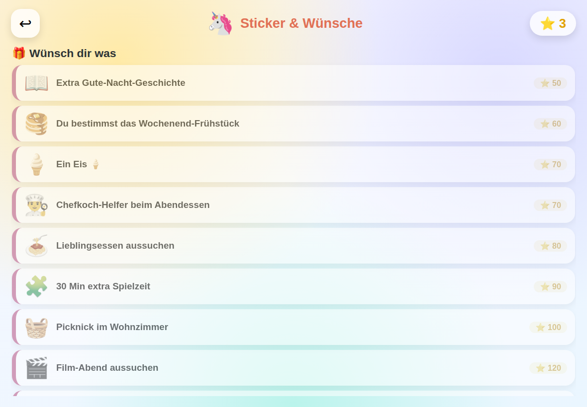
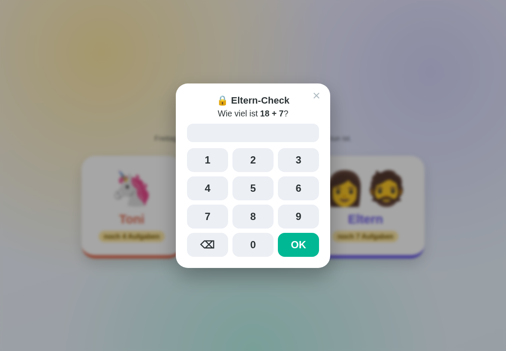
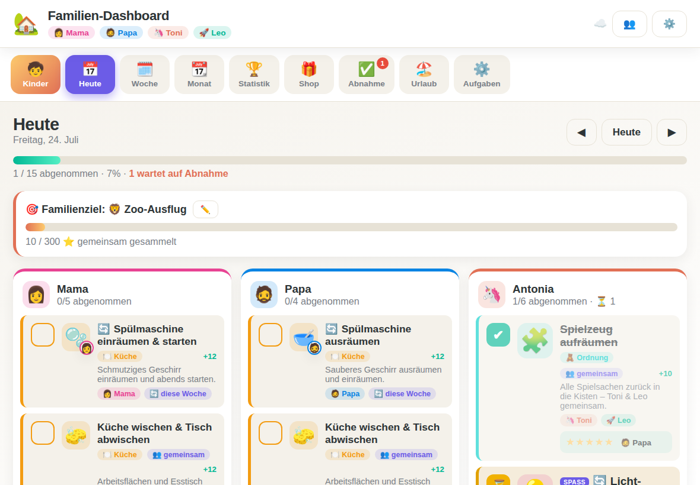
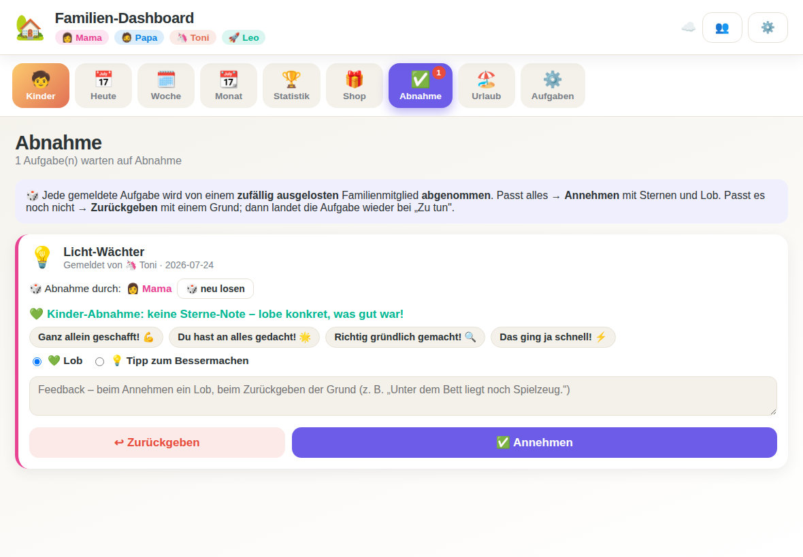

# 🏡 Familien-Dashboard

Ein spielerisches Aufgaben-Dashboard für die ganze Familie – gedacht als
digitale Tafel auf dem iPad. Es zeigt die täglichen, wöchentlichen und
monatlichen Aufgaben im Haushalt und motiviert Groß und Klein, ihren Beitrag
zum Familienleben zu leisten.

Gebaut für **Mama, Papa, Antonia (Toni, 4)** und **Leonard (Leo, 4)** – lässt
sich aber jederzeit anpassen.

## 📸 Screenshots

| Start: Wer bist du? | Kinder-Board |
|---|---|
|  |  |

| Fokus mit Sanduhr | Wünsche & Sticker |
|---|---|
|  |  |

| Eltern-Sperre | Heute-Ansicht (Eltern) |
|---|---|
|  |  |

| Abnahme mit Lob-Bausteinen | |
|---|---|
|  | |

## ✨ Funktionen

- **Start-Bildschirm „Wer bist du?"** – beim Öffnen wählt jeder sich selbst:
  Toni und Leo landen direkt in ihrem Kinder-Board, die Eltern im Dashboard.
  Jede Kachel zeigt, wie viele Aufgaben heute noch offen sind.
- **Eltern-Sperre** 🔒 – die Eltern-Ansicht (Editor, Abnahme, Zurücksetzen) ist
  durch eine kleine Rechenaufgabe geschützt, die Vierjährige noch nicht lösen können.
- **Heute** – alle Aufgaben des Tages, nach Person sortiert, mit Fortschrittsbalken. Antippen = erledigt.
- **Wochenansicht** – die ganze Woche auf einen Blick (Mo–So).
- **Monatsansicht** – Kalender mit Fortschritt pro Tag und Monats-Punktestand.
- **Aufgaben für alle** – Kinderaufgaben (altersgerecht), Erwachsenen-Aufgaben und gemeinsame Aufgaben.
- **Rotierende Aufgaben** 🔄 – manche Aufgaben wechseln wöchentlich reihum. Dabei
  gilt: **Eltern-Aufgaben rotieren nur zwischen Mama & Papa, Kinder-Aufgaben nur
  zwischen Toni & Leo** (abgeleitet aus der Gruppe). Pro Aufgabe im Editor an-/abschaltbar.
- **Große, klare Icons** – jede Aufgabe hat ein deutliches Symbol; bei Kindern
  zusätzlich vergrößert und mit dem persönlichen Zeichen (🦄/🚀) versehen, damit
  auch die Kleinen sofort erkennen, was für sie ansteht. Icons per Emoji-Auswahl setzbar.
- **Kinder-Modus** 🧒 – ein eigener Vollbild-Modus für die Kinder (Button „Kinder"),
  entwicklungsgerecht für Vierjährige gestaltet:
  - „Wer bist du?" → großes Kind-Bild auswählen
  - Board mit zwei Spalten **„Zu tun" → „Geschafft"** mit riesigen Icons;
    gemeldete Aufgaben liegen mit 👀 schon bei „Geschafft", bis sie abgenommen sind
  - Antippen öffnet ein **Fokus-Vollbild** mit nur einer Aufgabe
  - **Vorlesen** per Tippen (Sprachausgabe, da noch nicht lesend)
  - großer **„Fertig!"-Knopf** mit **Konfetti + Jubel-Klang**
  - Fortschritt als sich füllendes **Belohnungsglas** (statt abstrakter Zahlen);
    füllt sich hell schon beim Melden, kräftig nach der Abnahme
  - **„Wünsche & Sticker"** 🎁 – Sterne-Guthaben, Sticker-Album und echte
    Belohnungen direkt im Kinder-Modus: Das Kind „wünscht" sich eine
    Belohnung mit seinen Sternen; eingelöst wird der Wunsch von den Eltern
    (Shop → einlösen). Nach dem Kauf sagt die App klar: „Zeig das Mama
    oder Papa – sie machen es mit dir aus!"
  - **Tageswahl** 🎁 – das Tages-Special dürfen sich die Kinder aussuchen
    (wer zuerst wählt, bekommt seinen Wunsch; das andere geht ans Geschwisterkind)
  - **Sanduhr** ⏳ im Fokus-Bildschirm: Wettlauf gegen den Sand (5 Minuten,
    rein spielerisch – am Ende nur ein freundlicher Klang)
  - Lob auf **Beitrag & Anstrengung** („du hast geholfen!"), kein Scheitern-Frame
- **Kinder-Abnahme ohne Sterne-Note** – Kinder-Arbeit wird nicht benotet:
  Statt Sternen gibt es Lob-Bausteine für konkretes, anstrengungsbezogenes
  Feedback („Ganz allein geschafft!"). Sterne gibt es nur unter Erwachsenen.
- **Familienziel** 🎯 – gemeinsames Sparziel statt Rangliste: Alle Punkte der
  Familie zählen zusammen auf ein Ziel (z. B. Zoo-Ausflug); Fortschritt als
  Balken in der Heute-Ansicht und auf dem Kinder-Board. Festlegen in der
  Heute-Ansicht.
- **Klassisch & ausgefallen** – von „Spülmaschine ausräumen" bis „Krümel-Detektiv", „Familien-DJ" und „Licht-Wächter".
- **Gemeinsame Aufgaben** – mehrere Personen erledigen etwas zusammen
  (ein gemeinsames Häkchen, z. B. „Spielzeug aufräumen").
- **„Jeder für sich"-Aufgaben** 👤 – persönliche Routinen wie Morgen-Held,
  Abend-Held oder Kita-Auspacker erzeugen pro Kind eine **eigene Karte**:
  Jede/r hakt selbstständig ab, wird einzeln abgenommen und bekommt eigene
  Punkte. Pro Aufgabe im Editor umschaltbar.
- **Urlaub & Vertretung** – freie Tage/Wochen eintragen; die App zeigt, welche
  Aufgaben jemand anderes übernehmen muss, und man kann eine Vertretung wählen.
- **Abnahme-Workflow** – jede Aufgabe durchläuft **Zu tun → Zur Abnahme → Abgenommen**:
  Wer fertig ist, meldet die Aufgabe; ein *zufällig ausgelostes* Familienmitglied
  **nimmt sie ab** (mit Sternen und Lob 💚) oder **gibt sie mit Begründung zurück**
  (↩︎ Tipp 💡) – dann landet sie wieder bei „Zu tun" samt Hinweis, was noch fehlt.
  Punkte gibt es erst nach der Abnahme.
- **Spielerische Statistiken** – Punkte, Level, Serien (🔥 Streaks), Abzeichen
  und eine Wochen-Rangliste, die zum Mitmachen anspornt.
- **Belohnungs- & Sticker-Shop** – erspielte Punkte gegen echte Belohnungen
  (z. B. „Film-Abend aussuchen", „ein Eis") oder digitale Sammel-Sticker
  eintauschen. Jedes Familienmitglied hat ein eigenes Punkte-Guthaben und ein
  Sticker-Album zum Vervollständigen. Belohnungen können von Erwachsenen als
  „eingelöst" markiert oder wieder storniert werden (Punkte zurück).

## ☁️ Cloud-Speicherung (Supabase)

Die Daten werden mit **Supabase** synchronisiert: Alle Geräte der Familie
(iPad, Eltern-Handys …) sehen denselben Stand. Der Browser-Speicher bleibt
als **Offline-Cache** erhalten – die App funktioniert ohne Netz weiter und
lädt Änderungen automatisch nach, sobald wieder Verbindung besteht. Das
Wolken-Symbol ☁️ oben rechts zeigt den Sync-Status (🔄 lädt, 📴 offline,
⚠️ Fehler).

Der Zugriff ist durch ein **Familien-Login** geschützt: Nur angemeldete
Geräte können die Daten lesen und schreiben. Jedes Gerät meldet sich einmal
an (⚙️ → „Cloud-Anmeldung") und behält die Sitzung dauerhaft – die Kinder
merken davon nichts.

**Einmalige Einrichtung** im Supabase-Dashboard:

1. **SQL Editor** → dieses Skript ausführen (legt die Tabelle an und
   beschränkt den Zugriff auf angemeldete Benutzer):

```sql
create table if not exists public.dashboard (
  id text primary key,
  data jsonb not null,
  updated_at timestamptz not null default now()
);

alter table public.dashboard enable row level security;

-- Falls vorhanden: alte, offene Richtlinien entfernen
drop policy if exists "dashboard lesen"   on public.dashboard;
drop policy if exists "dashboard anlegen" on public.dashboard;
drop policy if exists "dashboard aendern" on public.dashboard;

-- Zugriff nur für angemeldete Benutzer (das Familien-Konto)
create policy "familie lesen"   on public.dashboard for select to authenticated using (true);
create policy "familie anlegen" on public.dashboard for insert to authenticated with check (true);
create policy "familie aendern" on public.dashboard for update to authenticated using (true) with check (true);
```

2. **Familien-Konto anlegen:** *Authentication → Users → „Add user"* –
   eine E-Mail-Adresse und ein starkes Passwort, dabei **„Auto Confirm
   User"** anhaken. Dieses eine Konto nutzt die ganze Familie.
3. **Registrierung abschalten (wichtig!):** *Authentication → Sign In / Sign Up*
   → **„Allow new users to sign up" deaktivieren.** Sonst könnte sich jeder
   Fremde selbst ein Konto anlegen und wäre damit „angemeldet".

Projekt-URL und Publishable-Key stehen in `js/cloud.js` (`SUPABASE_URL`,
`SUPABASE_KEY`). Der Publishable-Key ist für den Browser gedacht und darf
öffentlich im Code stehen – die eigentliche Zugriffskontrolle übernehmen
Login + RLS-Richtlinien.

## 📱 Auf dem iPad einrichten

Die App ist eine reine Webapp – **kein Server, kein Login, keine Installation
nötig**. Die Daten liegen in Supabase (siehe oben) und zusätzlich als
Offline-Cache auf dem Gerät.

**Empfohlen (mit Offline-Betrieb & App-Symbol):**

1. Dateien auf einen Webspace/Server legen, oder z. B. über **GitHub Pages**
   veröffentlichen (Repo-Einstellungen → Pages → Branch auswählen).
2. Die Adresse in **Safari** auf dem iPad öffnen.
3. Auf **Teilen → „Zum Home-Bildschirm"** tippen.
4. Fertig – die App startet dann im Vollbild wie eine echte App und funktioniert
   auch offline.

**Schnell mal ausprobieren (lokal):**

```bash
# im Projektordner einen kleinen Webserver starten
python3 -m http.server 8000
# dann im Browser öffnen:  http://localhost:8000
```

> Ein lokaler Server wird empfohlen, weil Offline-Modus (Service Worker) nur
> über `http(s)` funktioniert. Zum reinen Ausprobieren genügt aber auch das
> direkte Öffnen der `index.html`.

## 🛠️ Anpassen

- **Aufgaben** ändern, hinzufügen oder löschen: Reiter **Aufgaben** in der App.
- **Familienmitglieder** hinzufügen, bearbeiten oder entfernen: Zahnrad ⚙️ →
  Abschnitt „Familie". Beim Entfernen bleiben Punkte und Verlauf erhalten;
  Aufgaben, die nur dieser Person gehörten, werden pausiert. (Der
  Startbestand für neue Installationen steht in `js/data.js` unter `MEMBERS`.)
- **Standard-Aufgabenkatalog**: in `js/data.js` unter `DEFAULT_TASKS`.
- **Daten sichern / übertragen**: Zahnrad ⚙️ oben rechts → Sichern / Einlesen
  (JSON-Datei). So lassen sich die Daten z. B. auf ein anderes Gerät bringen.
  Die App merkt sich die letzte Sicherung und erinnert mit einem roten Punkt
  am Zahnrad, wenn sie länger als 30 Tage her ist. Zusätzlich bittet die App
  den Browser um dauerhaften Speicher (`navigator.storage.persist()`), damit
  die Daten nicht bei Platzmangel aufgeräumt werden.

## 🚀 Selbst betreiben (für andere Familien)

Dieses Projekt ist quelloffen ([MIT-Lizenz](LICENSE)) – du darfst es frei
nutzen und anpassen. Jede Familie betreibt dabei ihre **eigene** Instanz mit
**eigener** Datenbank; die Daten verschiedener Familien berühren sich nie.

1. **Repo forken** (GitHub: „Fork") oder herunterladen.
2. **Eigenes Supabase-Projekt anlegen** (kostenloses Konto auf supabase.com
   reicht) und die drei Einrichtungs-Schritte aus dem Abschnitt
   „Cloud-Speicherung" oben ausführen (SQL, Familien-Konto anlegen,
   Registrierung abschalten).
3. In `js/cloud.js` die eigenen Werte eintragen: `SUPABASE_URL`
   (Projekt-URL) und `SUPABASE_KEY` (Publishable/Anon-Key, beides unter
   *Settings → API*).
4. **Familie anpassen:** Mitglieder über ⚙️ → „Familie" in der App pflegen;
   der Startbestand (Namen/Emojis beim allerersten Start) steht in
   `js/data.js` unter `MEMBERS`, der Aufgaben-Katalog darunter.
5. **GitHub Pages aktivieren:** Repo-Einstellungen → Pages → Branch `main`
   auswählen. Danach die Pages-Adresse auf dem iPad öffnen und über
   **Teilen → „Zum Home-Bildschirm"** installieren.

> Ohne Supabase läuft die App übrigens auch – dann bleiben die Daten rein
> lokal auf dem Gerät (das ☁️-Symbol zeigt einen Fehler, alles andere
> funktioniert normal).

## 🗂️ Projektaufbau

```
index.html              Grundgerüst
manifest.webmanifest    PWA-Einstellungen (Home-Bildschirm)
sw.js                   Service Worker (Offline)
css/styles.css          Design (hell & dunkel, iPad-optimiert)
js/data.js              Familie & Standard-Aufgaben
js/store.js             Datenhaltung, Logik, Statistik (localStorage-Cache)
js/cloud.js             Cloud-Sync mit Supabase
js/ui.js                Ansichten / Oberfläche
js/app.js               Navigation & Start
icons/                  App-Symbole
```

Keine Abhängigkeiten, kein Build-Schritt – reines HTML/CSS/JavaScript.
